# Dev console basics

## Dev console

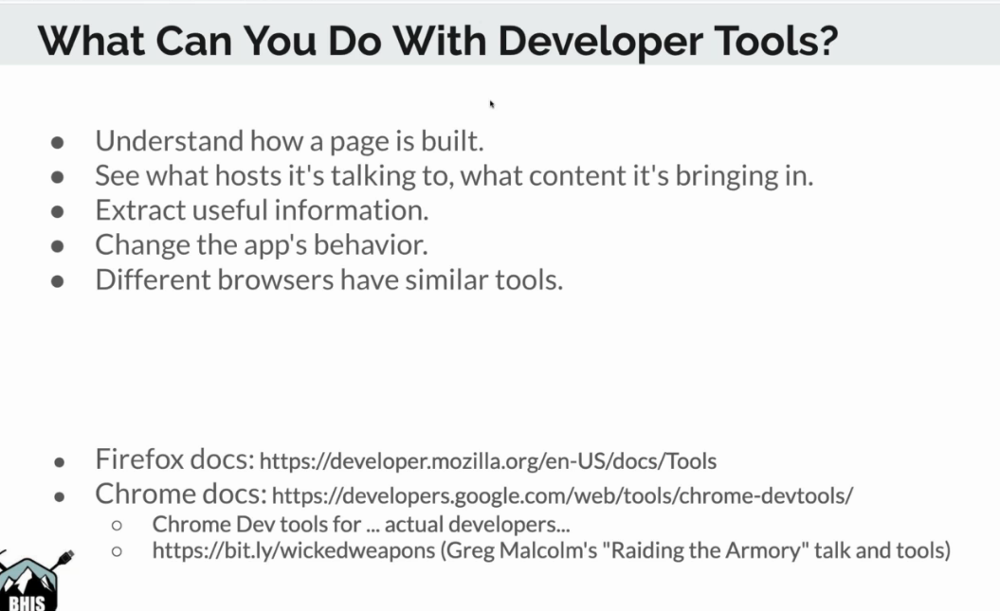

inspector = one element 

dom = object structure \(all the page\)

### Tools

keep the console open \(esc\)

console.log cause no input output

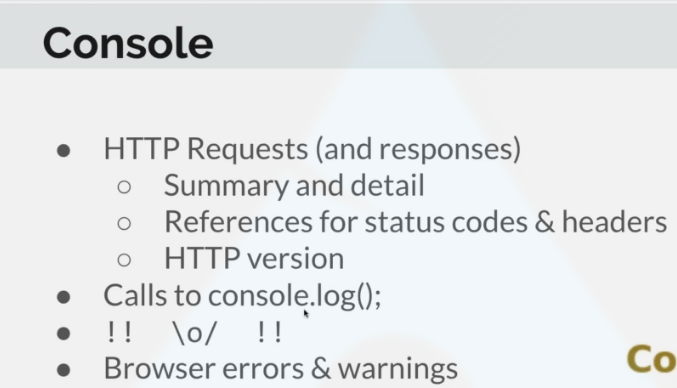

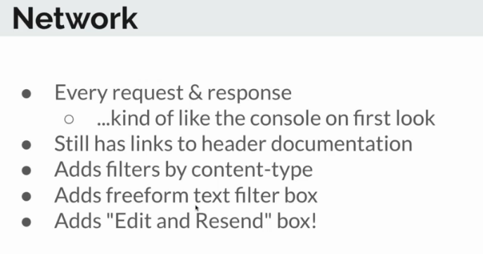

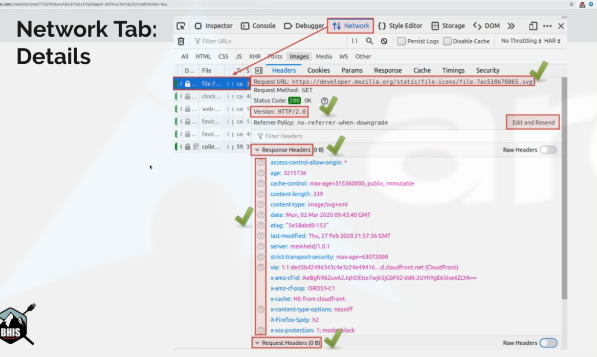

### repeater

edit = repeater

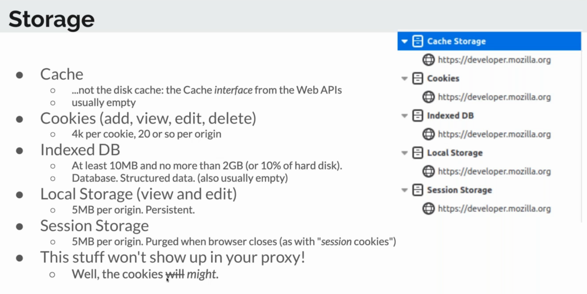

### Cookie 

add admin = True .... sometimes it works :\)

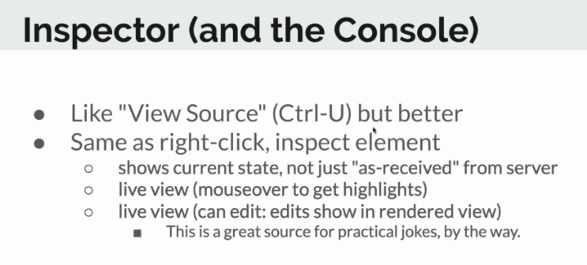

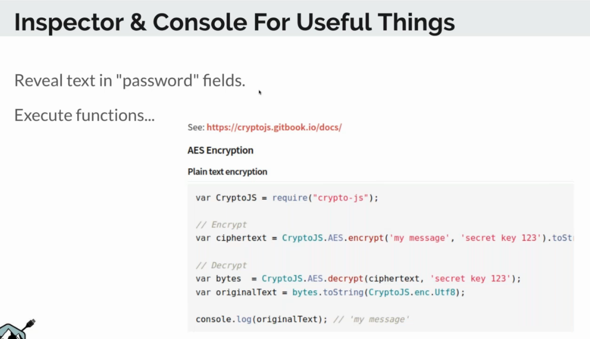

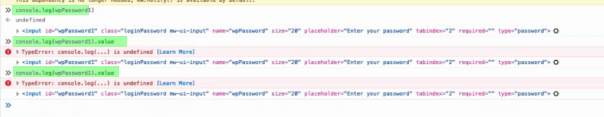

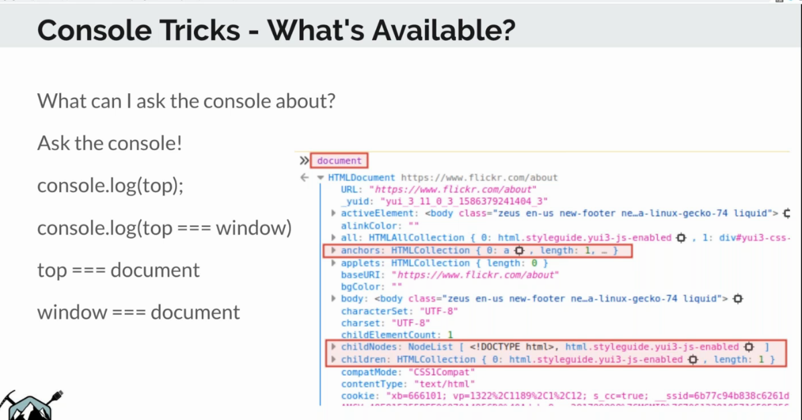

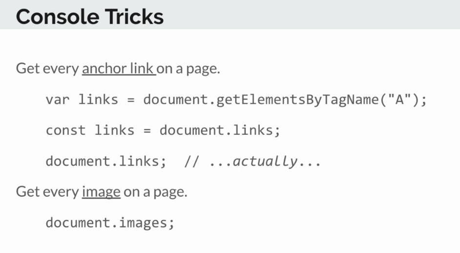

### Get source

Using netwok tab, type of file JS, {} button and right click, we can get the source :

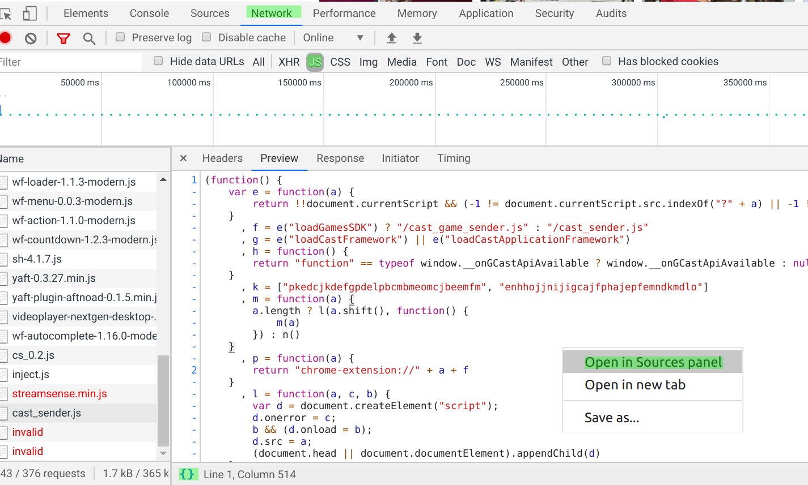

In source, CTRL+f to search:

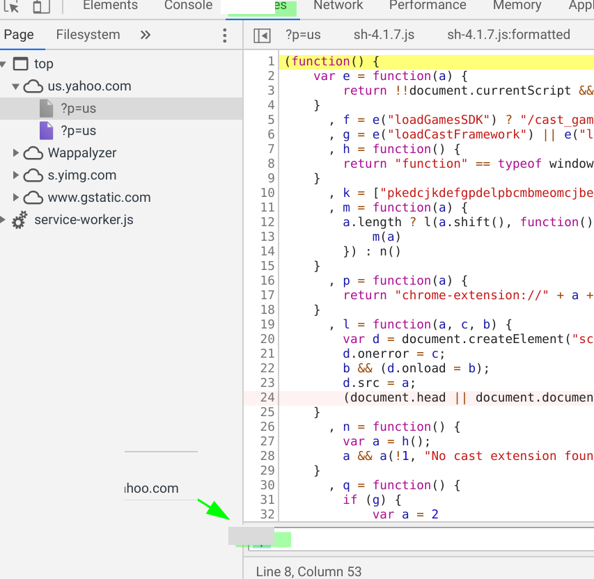

### Search for api call in XHR \(Xml HTTP Request\)

Search for api call, and check for initiator:

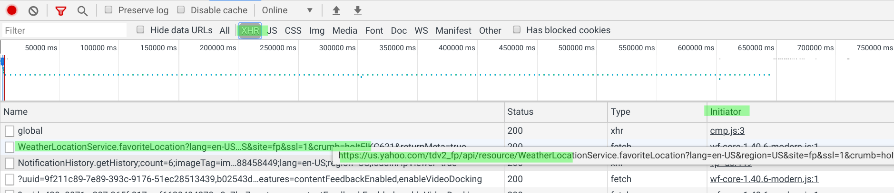

Send select a term, search for it and check the response file on source

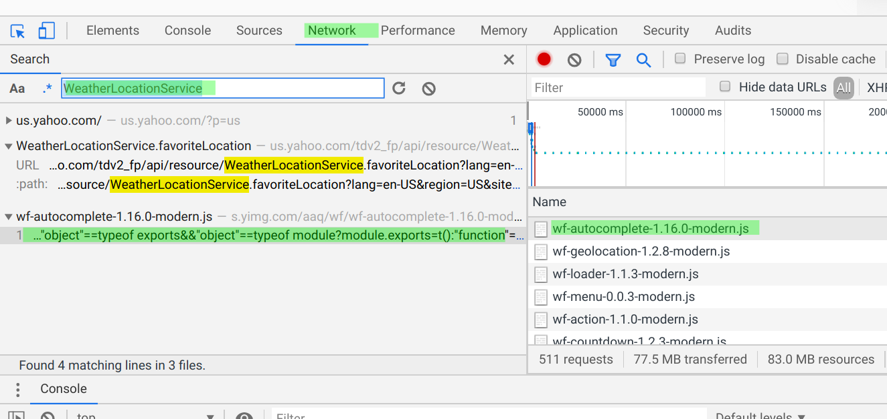

### Stuff to try

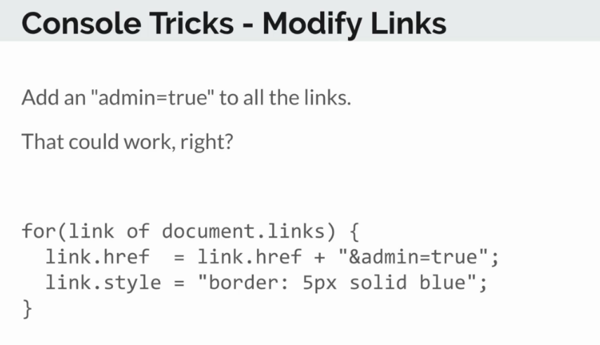

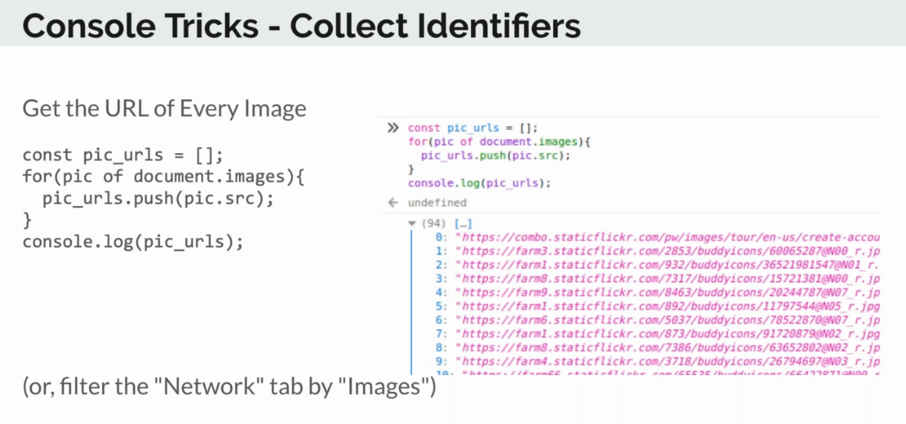

### Resources 



