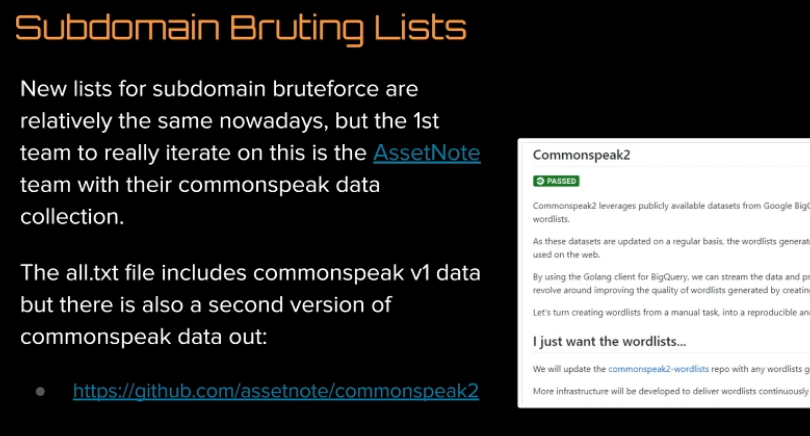

# Bug Bounty jhaddix Methodology v4.0

## Bug Bounty jhaddix Methodology v4.0

### Find Seeds/Root domain

[https://crunchbase.com](https://crunchbase.com)

organisation info

### Search for ASP

[https://bgp.he.net](https://bgp.he.net)

### enumeration

* metabigor

`echo 'tesla' | metabigor net --org -v`

* asnlookup

`python asnlookup -o tesla`

* amass

`amass intel -asn 46498`

* reverse whois

[https://whoxy.com](https://whoxy.com)

* vysecurity domlink `python domlink -d vip.com -o vip.out.txt`
* builtwith

[https://builtwith.com](https://builtwith.com)

* Google-Fu

"copyright"

* Shodan

## finding subdomains

### Linked Discovery

### Burp Advanced scope

#### Spider

ctrl + A -&gt; spider and start over again :\)

#### export

Engagement tools -&gt; analyze target -&gt; html

#### Without burp :

hakrawler or goSpider

### Subdomainizer

Can find cool stuff , then search in burp history ...

## Subdomain Scraping

* Amass
* Subfinder\(v2\) =&gt; projectdiscovery.io
* github-subdomains.py

gwendal Le Coguic

* Shodan parser

shosubgo

* Cloud range

## Subdomain brutefoce

* amass using -rf
* shuffleDNS \(projectdiscovery\)
* wordlist tech from tomnomnom
* commonspeak2 \(github assetnote\)

## WAF bypass

## Port Analysis

### Masscan

`masscan -p1-65535 -iL $ipFile --max-rate 1800 -oG $outputfile.log`

### dnsmasscan

## Service Scanning

### brutespray

## Github dorking

## Screenshot

Aquatone - Eyewitness

## Subdomain Takeover

* Subover
* nuclei \(projectdiscovery,\)

## Automation

* interlace 

