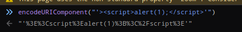

# Dom XSS

## DOM XSS

Dom XSS = Client side XSS or JS XSS

### Listeners

From the source file, we can check Global Listeners

From Global Listener, search **"message"**

Set a break point in the code and use the console to post something random using window.PostMesage\('message', 'target origin'\)

### Example \(Firing range [https://public-firing-range.appspot.com/](https://public-firing-range.appspot.com/)\)

Set up a postmessage and a break point in the debugger

Set a new value to content and release the break point

XSS but there is nothing to steal \(httponly mitigation and Same Origin Policy, which deny javascript getting executed from other domains\).

* Element is giving the current view of the HTML code which has been manipulated by javascript

### ComplexMessageDocumentWriteEval

From the code, msg \(the input\) is waiting to for data and action:

* window.postmessage

### POC using repl.it------------- TODO

### Examples

`http://vulnerable.site/index.php#%3E%3Cscript%3Ealert(1)%3B%3C%2Fscript%3E`

