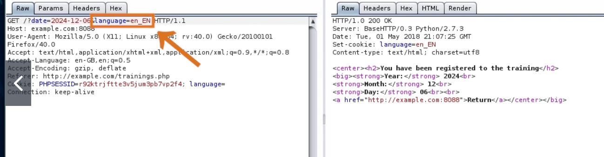
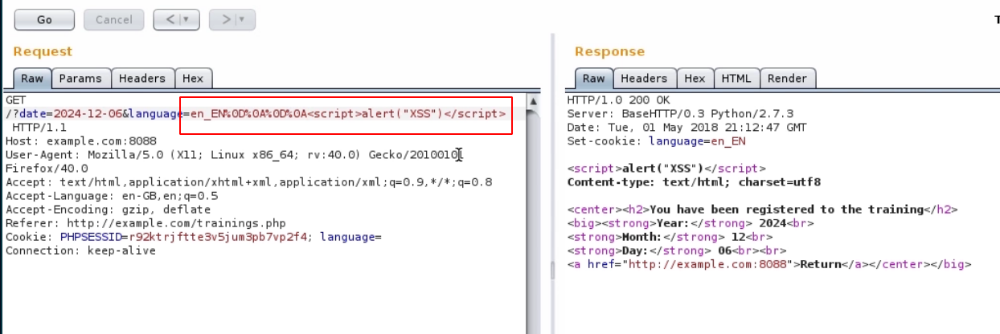

# HTTP response splitting

## HTTP response splitting

### **Reflected XSS into HTTP Header** 

value of a GET parameter is reflected in the the Set-cookie header

→ escape the HTTP header into HTTP body with

`%0D%0A%0D%0A`

