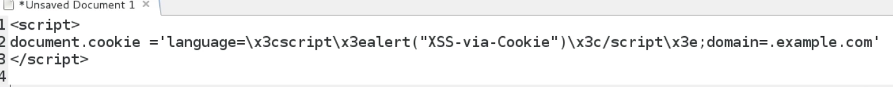

# XSS via cookie

## XSS via cookie

NOT only GET and POST !

* [**b.example.com**](http://b.example.com/) **is vulnerable to XSS.**
* we can attack [A.example.com](http://a.example.com/) using cookie injection :

and apply that on every subdomains linked to [example.com](http://example.com/) !

`pl`

