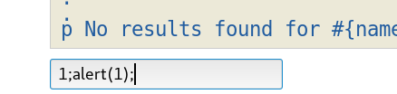
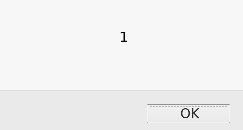

# Escaped String Interpolation into dynamic inline Javascript

## Escaped String Interpolation into dynamic inline Javascript

* **We are in a script tag . This is escaped string interpolation but it's vulnerable.**

We dont even need to use the tag `<script>`

`var user3 = #{name3}`

* so we are in 

```text
<script>
<p> no result for [escaped value user input] </p>
</script>
```

* we can just use  1;alert\(1\);





* Mitigation :

```text
var user3 = “#{name3}” and not #{name3}
```

