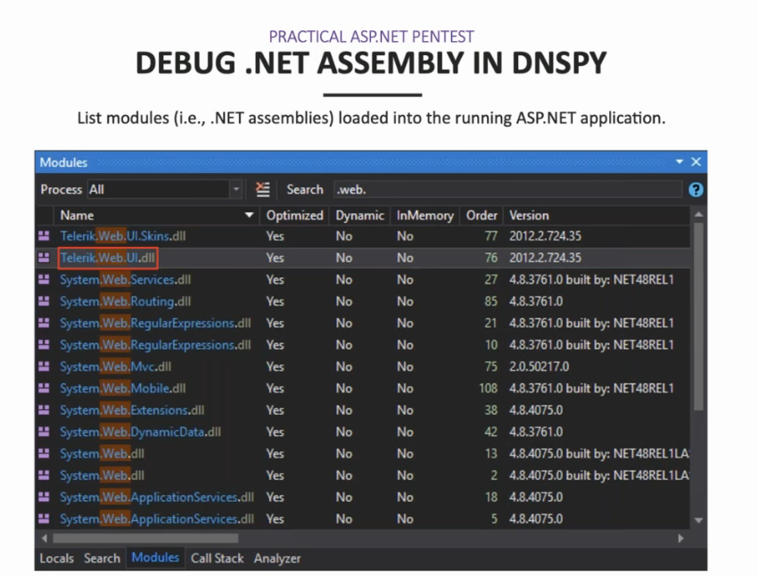
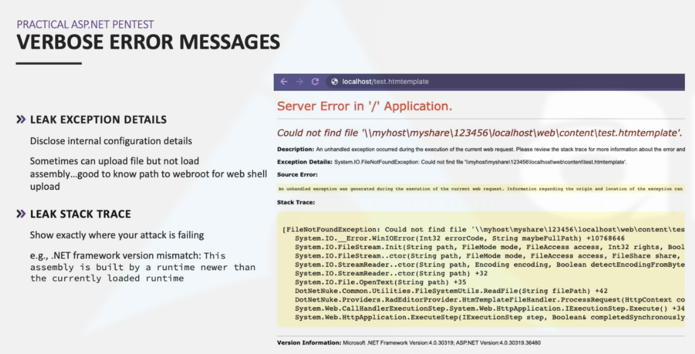
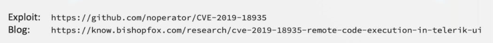

# ASP .NET real case scenario

## ASP .NET Real example

### install a webserver and debug DNSPY

Check version compatibility \(\)

Etag Hex to Decimal to get the timestamp

Version can be bruteforce

Cant upload the dll, use smb responder :

