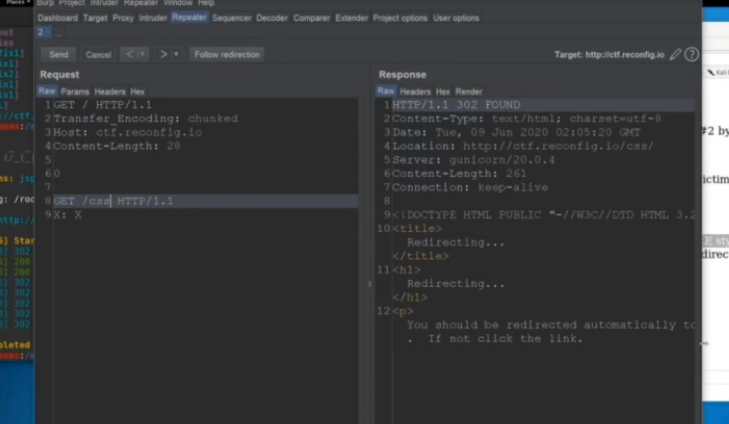

# HTTP request smuggling

## HTTP request smuggling

effective way to detect HTTP request smuggling vulnerabilities is to send requests that will cause a time delay in the application's responses if a vulnerability is present.

Content-Lenght and Transfer Encoding

```text
CL.TE Vulnerability 

1
A

X

TE.CL

0

X
```

## HTTP Smuggling


### CL.TE Desync attack


### TE.CL Desync attack


-&gt; post to a place where the attacker have access.


#### Payload


### CL.TE -&gt; open Desync


#### Payload


### GraphQL targets


### CL.TE -&gt; Open Desync


#### Payload


* Content lenght must be set to a long value


### POC





pipedream

### POC2

Session stealing using Response Queue 


### Resources

All credit goes to @defparm



#### Turbo intruder scripts.




​​


