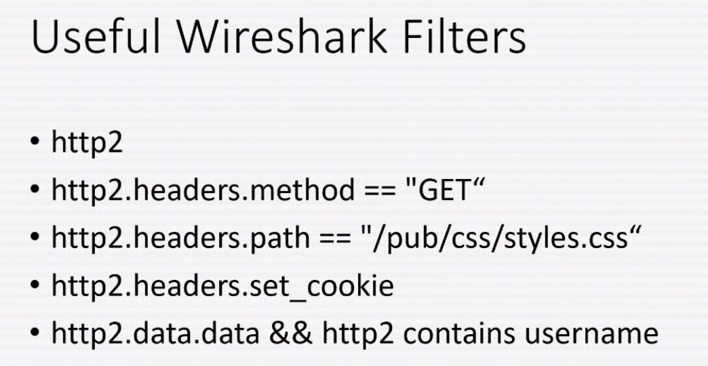

# HTTP2

## HTTP2 SSL capture howto

### Capture SSL keys

`chromium-browser -incognito --ssl-key-log-file="~/hackholiday/SSL-KEYS.txt" --new-window "https://packalyzer.kringlecastle.com/`

### Curl compatibility

* Remove curl:

`apt-get remove curl`

* Install deps

`apt-get install build-essential nghttp2 libnghttp2-dev libssl-dev libcurl4-openssl0dev -y`

* Download latest curl

`wget https://curl.haxx.se/download/curl-7.63.0.tar.xz`

\(create a simlink from /usr/lib/ssl to /usr/local/ssl ...\)

* Compile

```text
./configure --with-nghttp2 --prefix=/usr/local/ --with-ssl --with-libssl-prefix=/usr/local/ssl

make && make install
```

### Wireshark filters



