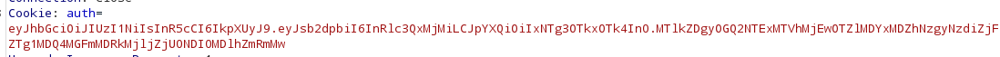
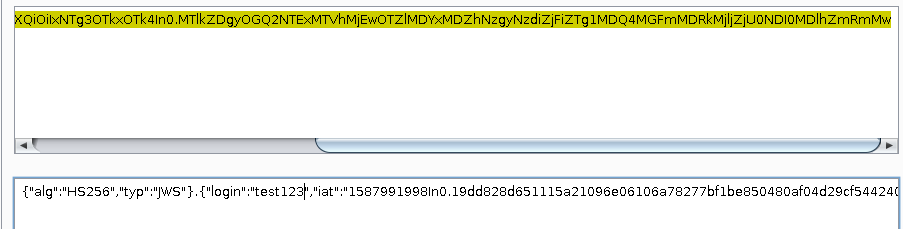
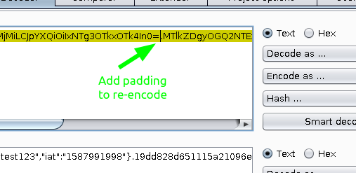
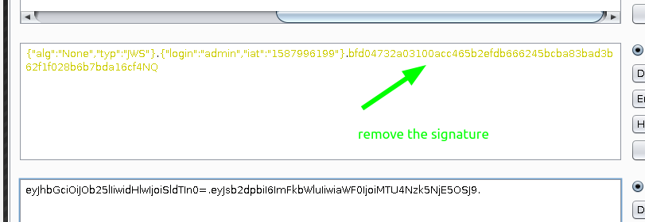

# Json Web Token

## JWT

Multiple signature methods can be used to ensure the integrity of JWT:

```text
    RSA based
    Elliptic curves
    HMAC
    None
```

### None algorithm for signature



* Decode the token:



* Add padding



* Base64 encoding and remove the signature.



### Bruteforce HS256 signed JWT

* Clone the repo

```csharp
git clone https://github.com/Sjord/jwtcrack
pip install PyJWT # or yay using arch linux
```

* Convert JWT token to john's format 

```csharp
python3 jwt2john <MY_JWT_TOKEN> > JWToutput.txt
john  JWToutput.txt
```

### Resources






