# PHPINFO LFI to RCE via race condition

## PHPINFO LFI

### Explainations

* The attack here is based on phpinfo.php page because upload\_file is enabled on the server :
* We are able to send a file \(which will be created in /tmp folder\)
* The only issue is that the file is deleted just after the server had read the request....
* The exploit will thus send a very long request which will let us the time to execute our php payload ...

## Race condition Exploit

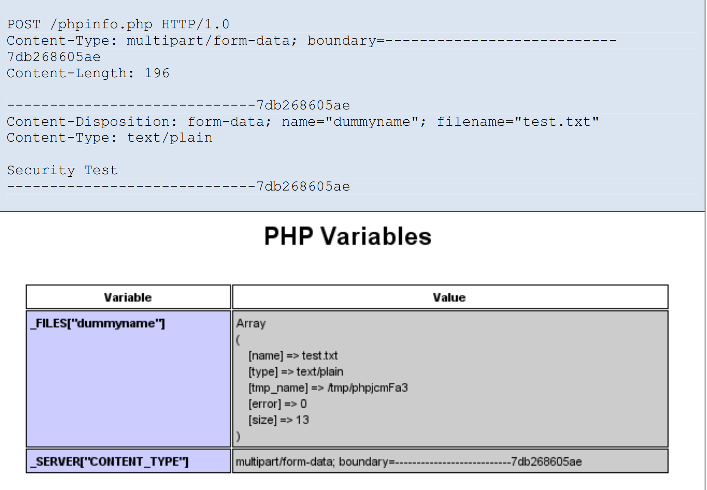

* on the server side

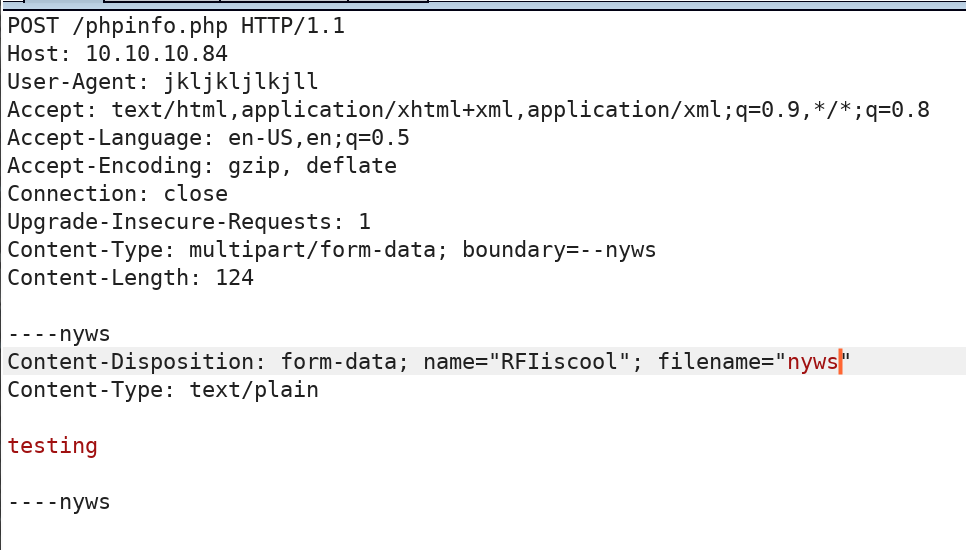

* Response

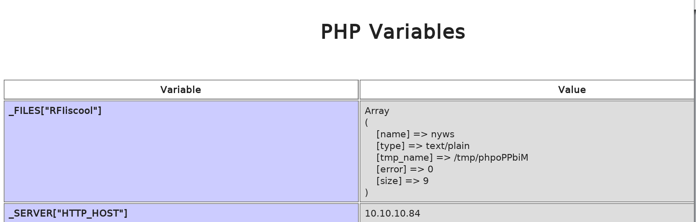

### Modify the exploit to fit our attack :

• Replace the payload with a php-reverse shell

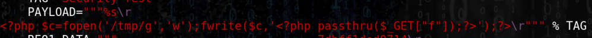

• Edit the php revershell and add the whole code on the exploit \(replacing the payload

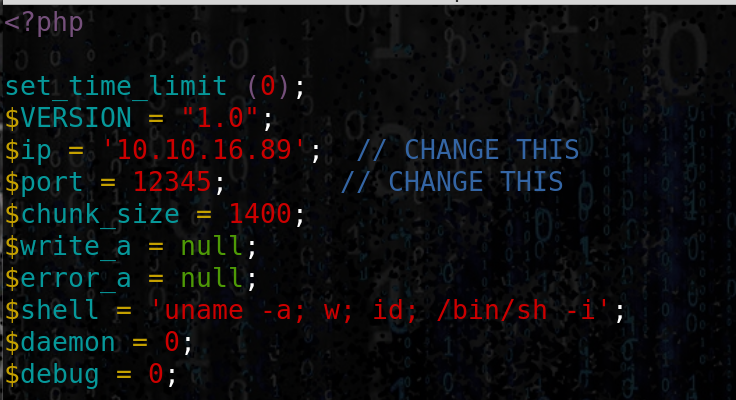

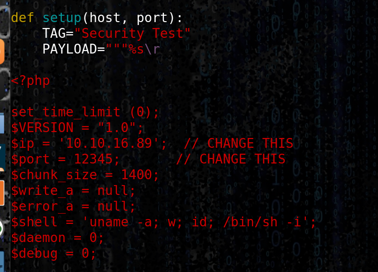

• Edit the LFI url :

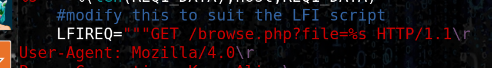

• Start the script \(correct the tmp path error in the code ...\) :

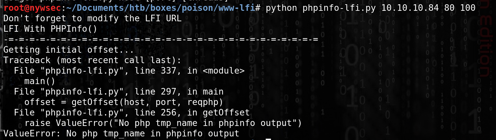

• Debug the request using Burp as a proxy :

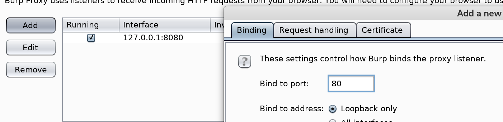

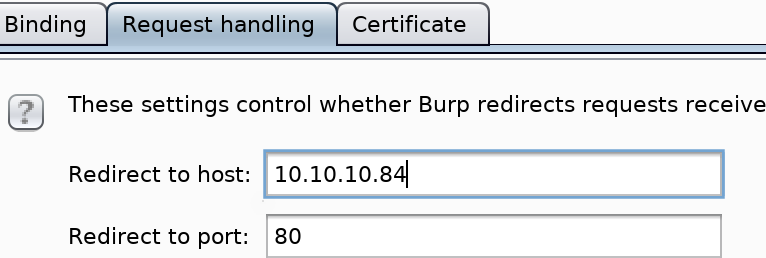

• Relaunch the attack on localhost 80

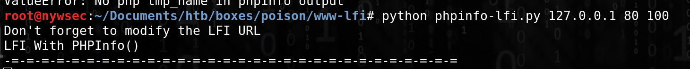

• Check the Request on Burp HTTP history and search for tmp to see what happened \(in the server's response\) ...

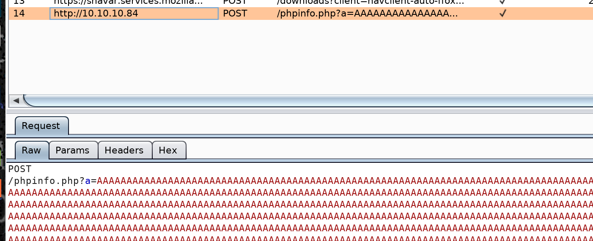

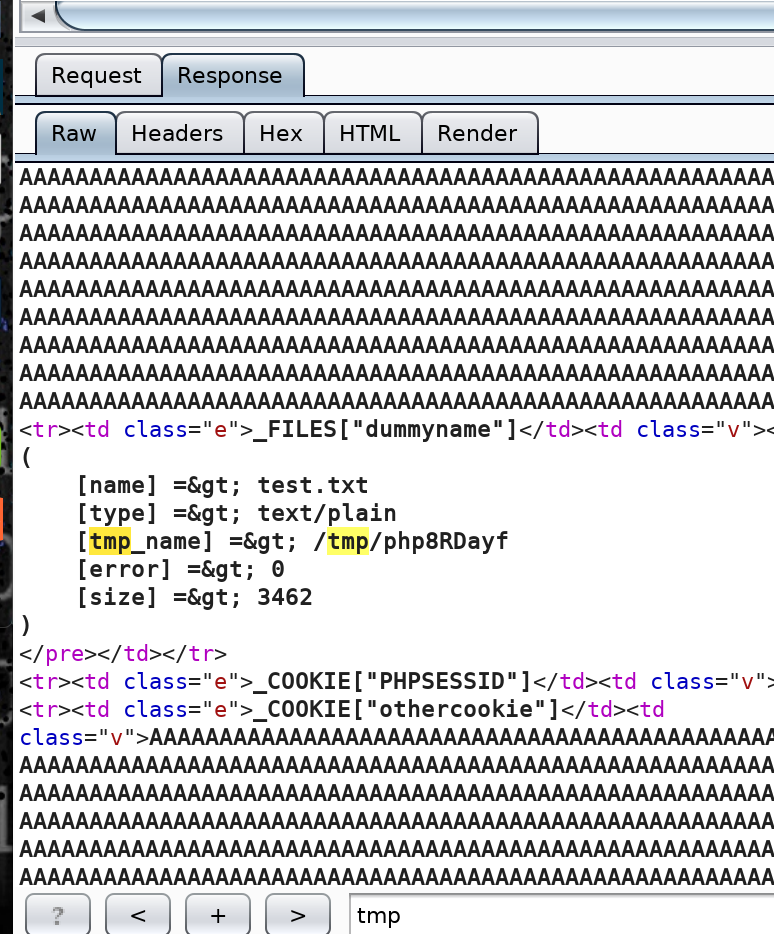

`[tmp_name] =&gt; /tmp/php8RDayf`

• Edit the script once again :

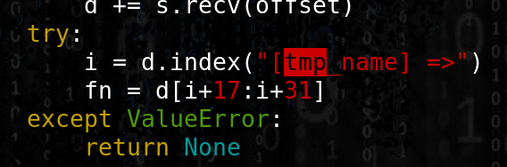

WITH

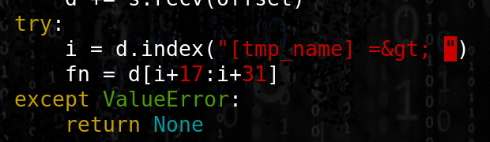

• Start the exploit and get the race condition :

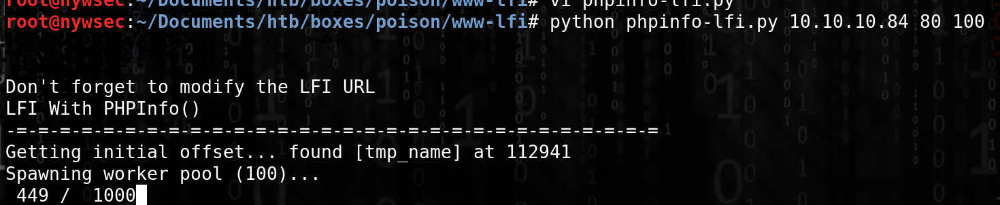

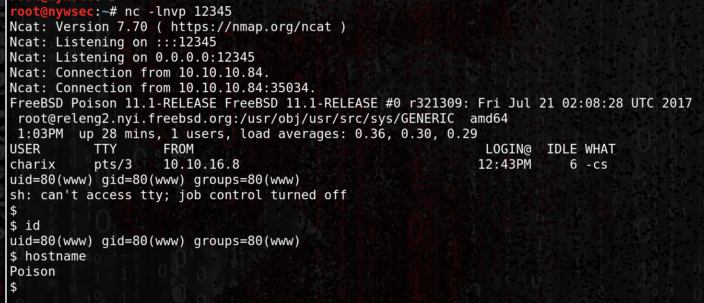

### Resources

[https://www.insomniasec.com/downloads/publications/LFI With PHPInfoAssistance.pdf](https://www.insomniasec.com/downloads/publications/LFI%20With%20PHPInfo%20Assistance.pdf)

[https://github.com/swisskyrepo/PayloadsAllTheThings/blob/master/File Inclusion - Path Traversal/phpinfolfi.py](https://github.com/swisskyrepo/PayloadsAllTheThings/blob/master/File%20Inclusion%20-%20Path%20Traversal/phpinfolfi.py)

