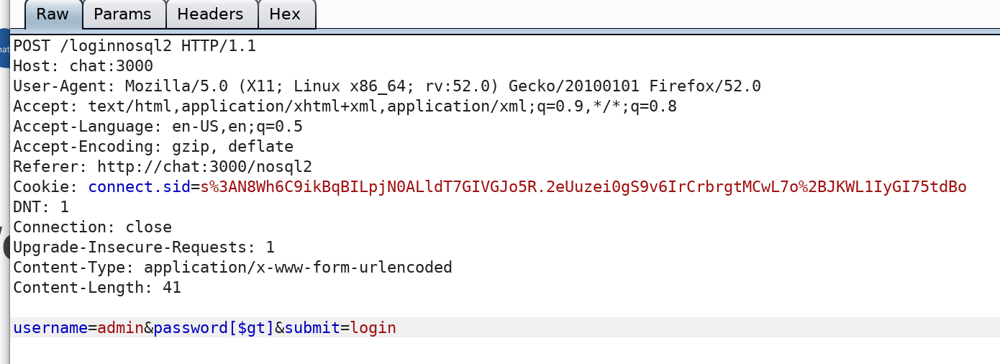
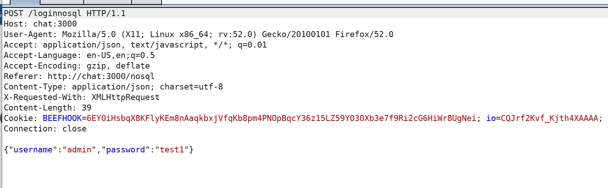
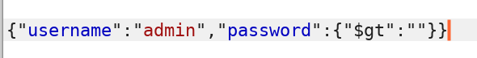

# Users - Passwords

## Users - Passwords

### Simple POC

* NodeJS has a QS module that has specific syntax to convert HTTP request params into JSON objects :
* Login request :


* Edit the POST request :



### Simple POC \#2

* Classic login form :



* Injection :



```text
{"$gt":""}

{"username":"admin","password":{"$gt":""}}
```

