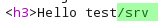
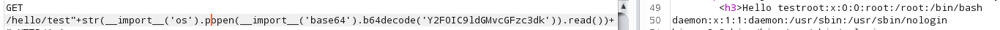

# Python Flask application

## Python Flask application

* Eval is used and the following route is used :

`@app.route('/whatever/something')`

* We can try to break it using 'quotes or double quotes':

* Looking for code execution using str:

* Response :

* Code execution:

&#x20;                    \* Fails

* Success:

* Bypass '/' blacklist using ding the command, ie `cat /etc/passwd`

