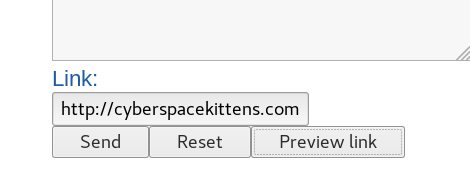
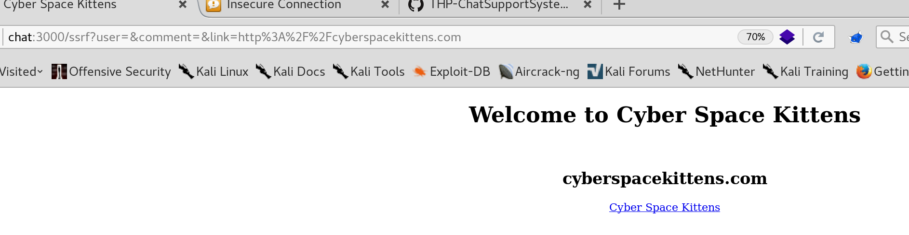
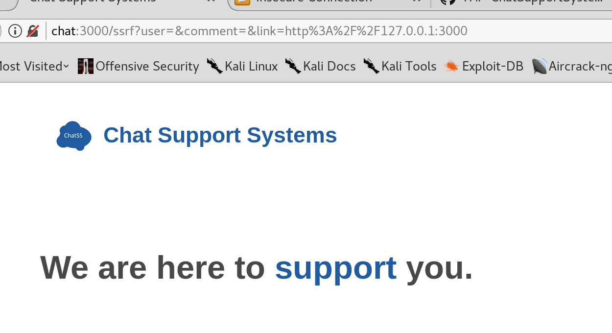
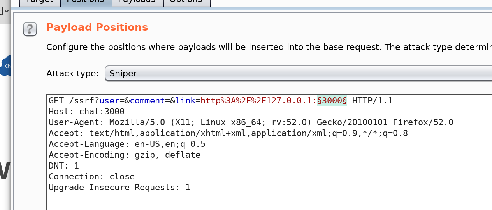
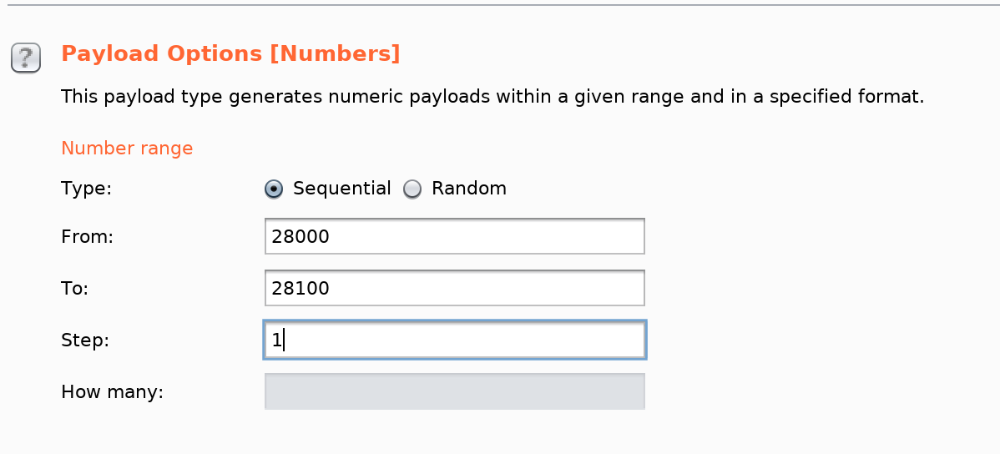
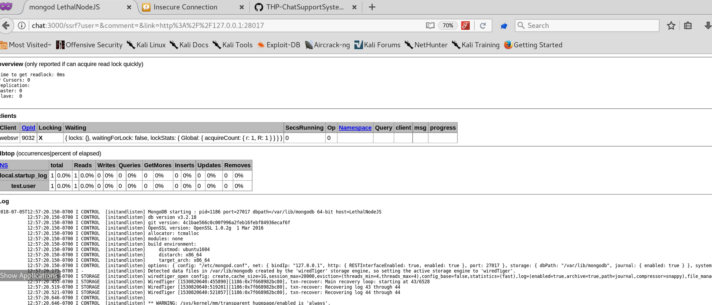
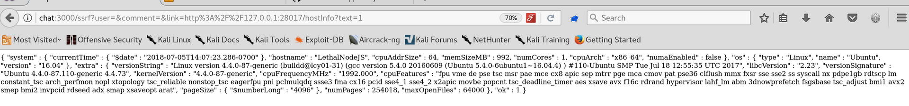

# SSRF POC

## SSRF POC

* **Create an account and enter an url in Direct message Link field**

* **Preview Link show that the application is vulnerable :**

* **using 127.0.0.1:3000**

* **Send the request in Burp intruder and create a payload :**

* **Start Attack and check to size response  \(port 28017\)**

