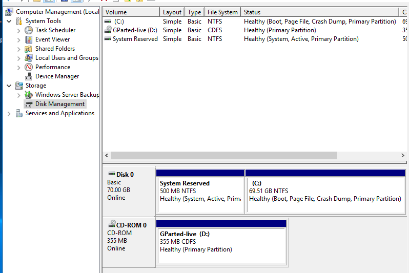

# Extend Disk

## Extend Disk

### Linux guest 

[https://computingforgeeks.com/how-to-extend-increase-kvm-virtual-machine-disk-size/](https://computingforgeeks.com/how-to-extend-increase-kvm-virtual-machine-disk-size/)

#### On the Host

`sudo qemu-img resize ubuntu-1804.qcow2 +20G`

* verify

`sudo qemu-img info ubuntu-1804.qcow2`

#### On the guest

* On the guest, grow the partition

`sudo apt -y install cloud-guest-utils`

`sudo growpart /dev/vda 1`

* Verify 

`lsblk`

#### Resize the filesystem

`sudo resize2fs /dev/vda1`

### Windows Guest

#### On the Host

`sudo qemu-img info windows-img.qcow2`

#### On the guest

resize the disk \(extend volume\)

### Resources



