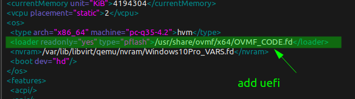

# No boot device error using windows 10

No boot device error using windows 10

## No boot device error using windows 10 <a id="no-boot-device-error-using-windows-10"></a>

#### Install ovmf firmware

```csharp
sudo pacman -S extra/edk2-ovmf
```

add the following line in the machine config \(overview XML\)




