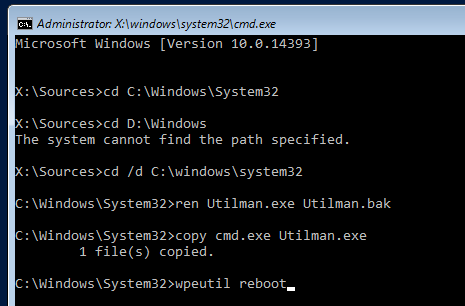
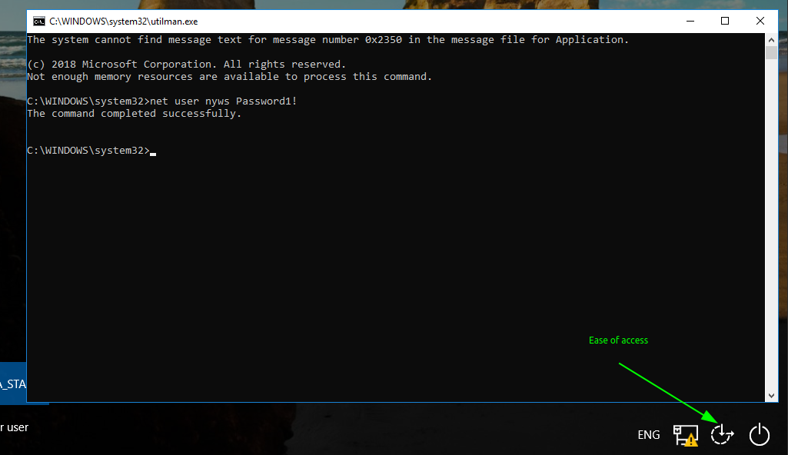

# Client password reset

## Password reset

* Boot on installation disk, and push `shift+F10`
* In Windows Sys Dir, rename Utilman and backup it, then replace it with cmd.exe

* Click on Ease of access, add  or modify user

* Reboot and restore utilman.exe

